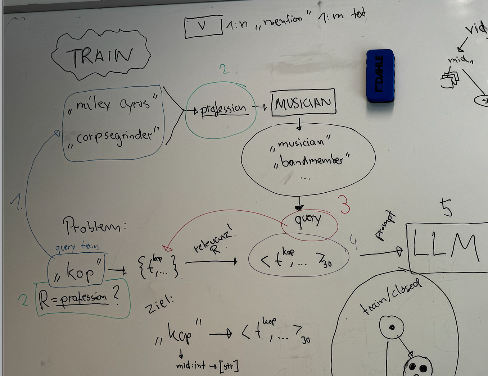

# IRT2 Bow Baseline

This repository contains the code for the `Bag-of-words (Bow) baseline` for `IRT2`.
The baseline is based on BM25.

## Install

### Elasticsearch

The baseline uses Elasticsearch for BM25. To run elasticsearch, you can use the `docker-compose` file provided in `/elastic`. We used Elasticsearch `version 8.13.4` for our experiments.
Security is disabled in the provided config.

```bash
$ cp ./elastic/.env.example ./elastic/.env
$ docker-compose --file ./elastic/docker-compose.yaml --env-file ./elastic/.env
```

You may update the variables in .env to your liking.

### Datasets

For convenience, most scripts in this repository load the datasets from a specified path / using a specific config.
The parameters are specified in `irt2_bow/__init__.py`. The current setup expects that the `irt2` repository and `irt2-bow` (this repo) share the same parent directory and that the datasets are placed inside `__root__/../data`.

We support the `irt2` datasets, as well as `blp/fb15k237` and `blp/wn18rr`. While the setup for "blp/wikidata5m" is also there, we have not tested the indexing of the dataset.

### Requirements

To install all required packages, we recommend `conda` + `pip3`:

```bash
# Create and source the virtual enviroment
$ conda create --prefix ./env python=3.11
$ conda activate ./env

# Install the required dependencies from setup.cfg
$ pip3 install -e .

# Install irt2
$ pip3 install -e /path/to/local/irt2
```

## Bow KGC Baseline

A knowledge graph can be represented as a set of ((head) vertex, relation, (tail) vertex) triples. In the IRT2 dataset, a vertex has one or more mentions, e.g., the vertex "Michael Jackson" could have the mentions "jackson", "king-of-pop".
In the KGC task, the goal is to predict matching heads / tails for given (?, relation, tail mention) / (head mention, relation, ?) tasks.

The idea of the bow baseline is that, given a head mention and relation (such as "king-of-pop" and "profession"), BM25 can be used to find similar, known vertices in the training corpus, that are linked to the target tail vertices. Same for the head-prediction task.

Precisely, given a (mention, relation) task, the steps are:

1. Use the texts associated with the mention to query for similar mentions using BM25. The order in which the mentions are found is important for scoring.
2. For every found mention, get the vertex of the mention.
3. For every found vertex, look-up known connected head/tail vertices in the knowledge graph based on the tasks' relation. These vertices are the "predicted" ones.
4. Build the scores for the predicted vertices based on the order of the mentions returned by BM25.


## Indexing

Before the bow baseline can be executed, the documents have to be indexed by elasticsearch.
For this, run the provided scripts:

```bash
# For IRT2 datasets
$ bash scripts/run_irt2_indexing.sh

# For BLP datasets
$ bash scripts/run_blp_indexing.sh
```

This will index the full as well as the subsampled splits and might take a while for the IRT2 datasets.

## Run KGC experiments

To run the KGC experiments, a script that runs the `head` and `tail` prediction tasks is provided (`scripts/run_kgc_exps.sh` and `scripts/run_kgc_subsample_exps.sh`), the results are evaluated, and a report is generated.
`Important`: Make sure to update the `OUTPUT_PATH` variable in the script to your desired directory. Otherwise, the root directory is used.

```bash
# Run the kgc experiments for all full dataset splits
$ bash scripts/run_kgc_exps.sh

# Run the kgc experiments for all full dataset splits
$ bash scripts/run_kgc_subsample_exps.sh
```

## Selecting Mention Texts

Given a mention and relation, the text-selection (or ordering) script can be used to propose for every pair, the (hopefully) most relevant docs associated for the mention+relation.

The steps for this are illustrated in the following Figure:



Steps 1-4 are programmed in `irt2_bow/text_selection/irt2_text_selection.py`. Again, the experiments can executed by running:

```bash
$ bash scripts/run_irt2_text-selection.sh
```

Make sure to specify the output directory in the script. To run this, you first need to create a mapping of mentions -> documents.
You can obtain this by executing the notebook `notebooks/build_mid_text_mapping.ipynb`.
By default, the mappings are placed in `.local/mappings`, this can be changed in `irt2_bow/__init__.py` > `MAPPINGS_DIR`.

